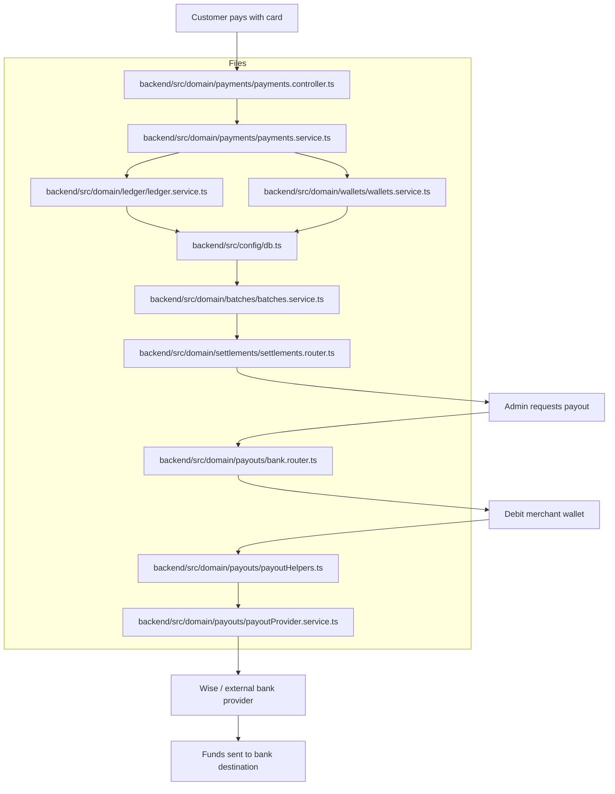

# Payout flow diagram

This document shows the end-to-end money flow for card payments and payouts in this repository.

## Exact files involved

- Payment entry: [backend/src/domain/payments/payments.controller.ts](../backend/src/domain/payments/payments.controller.ts)
- Payment processing: [backend/src/domain/payments/payments.service.ts](../backend/src/domain/payments/payments.service.ts)
- Ledger handling: [backend/src/domain/ledger/ledger.service.ts](../backend/src/domain/ledger/ledger.service.ts)
- Merchant wallet updates: [backend/src/domain/wallets/wallets.service.ts](../backend/src/domain/wallets/wallets.service.ts)
- Database persistence: [backend/src/config/db.ts](../backend/src/config/db.ts)
- Batch / settlement: [backend/src/domain/batches/batches.service.ts](../backend/src/domain/batches/batches.service.ts)
- Settlement API: [backend/src/domain/settlements/settlements.router.ts](../backend/src/domain/settlements/settlements.router.ts)
- Payout route: [backend/src/domain/payouts/bank.router.ts](../backend/src/domain/payouts/bank.router.ts)
- Wallet debit helper: [backend/src/domain/payouts/payoutHelpers.ts](../backend/src/domain/payouts/payoutHelpers.ts)
- Provider integration: [backend/src/domain/payouts/payoutProvider.service.ts](../backend/src/domain/payouts/payoutProvider.service.ts)

## Short explanation

- Card payment is stored and credited to the merchant wallet.
- Payout is a separate later step that debits the wallet and sends money to the bank destination.
- Settlement records are for reconciliation and do not by themselves send funds.
